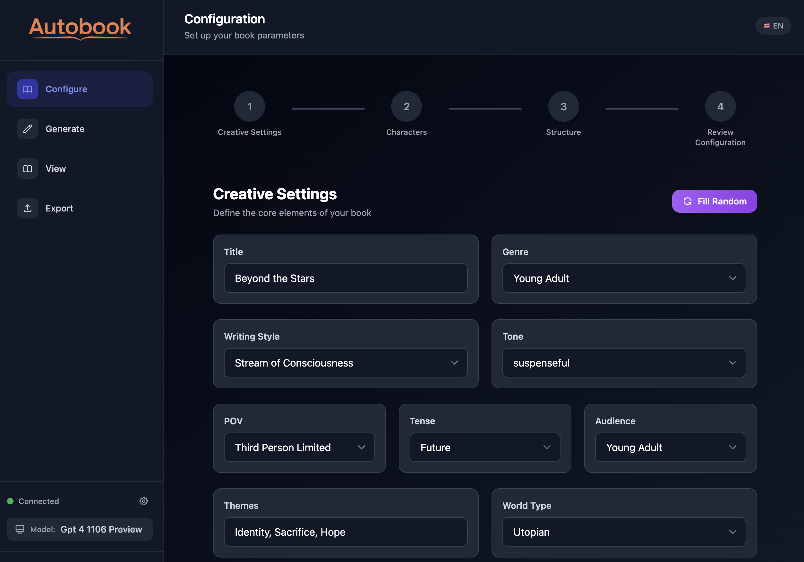

# AutoBook

<p align="center">
	
</p>

AutoBook is an AI-assisted book writing application built with Angular. It coordinates specialized agents to plan a story, generate chapters, review quality, and keep narrative consistency, then lets you export the final manuscript in multiple formats.

## What AutoBook Does

- Turns a high-level idea into a structured story blueprint.
- Generates chapter drafts with configurable style, tone, POV, and structure.
- Uses multiple review agents to critique writing quality and preserve continuity.
- Helps maintain character consistency across chapters.
- Exports results to PDF, EPUB, DOCX, and Markdown.

## Screenshot



## How It Works

AutoBook runs a multi-agent workflow where each agent has a focused role:

1. Architect creates the story plan and chapter structure.
2. Author writes chapter drafts from that plan.
3. Critic reviews chapters and flags quality issues.
4. Character checks character behavior and profile consistency.
5. Continuity verifies timeline and narrative coherence across chapters.

## Quick Start

Prerequisites:

- Node.js 18+ and npm
- Angular CLI (optional): `npm i -g @angular/cli`

Clone and run locally:

```bash
git clone https://github.com/MateuszPsuja/autobook.git
cd autobook
npm install
npm start
# open http://localhost:4200/
```

Available npm scripts:

- `npm start` - Start Angular development server.
- `npm run build` - Build production bundle.
- `npm run watch` - Build in watch mode.
- `npm test` - Run unit tests (Karma + Jasmine).

## Configuration

- Add your AI provider key in the app Settings screen before generation.
- The app supports OpenRouter-style API configuration and related provider credentials.

## Tests

```bash
npm test
```

The test suite uses Karma with Jasmine and runs in Chrome.

## Assets and Licensing

The repository includes DejaVu Sans for consistent export rendering.
See `src/assets/LICENSE-DejaVu.txt` for license details.
